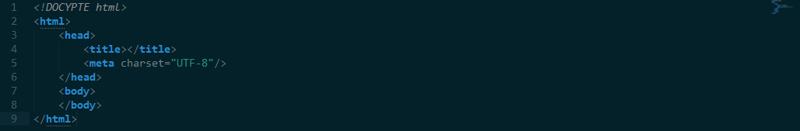

#【河北师范大学国旗队】

##设计目的

####1.熟练掌握HTML在组织结构上的优势。

####2.熟练掌握CSS在网页布局中的应用。

####3.学习Web标准及浏览器的兼容性。

####4.收获半学期的前端学习成果。

##设计步骤

###1.功能性需求分析

####该网站共有5个页面，其中每一个页面的屏幕截图及主要功能如下所列。

####整体结构：

####主题色系：红色

####（1）首页：

屏幕截图：

主要实现功能：

首页导航栏功能：

1）	首页及各级网页跳转或者锚点的跳转

2）	管理员的登陆（账号、密码）

3）	导航栏部分元素通过锚点跳转本页面内容

内容页功能：

1）	国旗队相关内容以模块展示

2）	河北省石家庄市各学校的国旗队（除大连海事）网站超链接

3）	时事政治、红色文献以超链接展示

4）	新闻中心（河北师大国旗队近一年的活动）

5）	专题活动（师大国旗队开展的专题红色活动展示）

####（2）二级页面：

二级页面（一）：

屏幕截图：

主要实现功能：

主体内容：

1）	对师大明星赵慧颖的介绍（文字介绍、图片展示）

2）	师大青年说上下期的跳转

右栏：

1）国旗队重要活动展示块（刀锋班、升旗仪式、启动仪式）

二级页面（二）：

屏幕截图：

主要实现功能：

主体内容：

1）	国旗预备队训练的介绍（图文混排）

2）	预备队训练的新闻、快讯、法律、训练心得推送以列表展示

二级页面（三）：

屏幕截图：

主要实现功能：

1）	站长作者的相关信心展示

2）	对站长的意见反馈，提交按钮

####（3）其他页面（封面）

屏幕截图：

主要实现功能：

1）	充当课程设计的封面，使课程设计内容结构更加完整

2）	对首页、招新、明星三个主要页面进行超链接跳转

3）	国旗队纳新视频的展示

###2.搜集网站素材:河北师大国旗队QQ推送号

###3.建立网站代码目录结构（截图给出目录结构）

###4.编写HTML代码

（1）首页部分：

整体结构：

核心源代码:

（2）二级页面：

整体结构：

核心源代码：

###5.编写CSS布局及样式

1）	CSS布局：

核心技术：

div的嵌套，margin对位置的选择

Float实现布局：

核心源代码：

（2）添加CSS样式：

通用类属性：

背景相关类属性：

###6.调试浏览器兼容性

(1)问题1：

在IE10+中的表现（屏幕截图）:

在火狐中的表现（屏幕截图）：

在Chrome中的表现（屏幕截图）：

解决方案（核心源代码）：

##问题记录

1.	问题表现：IE表现出的字体不够清晰

##设计总结

1.需求分析阶段的经验：

该网站的主题为国旗队网站，作为网站作者的我，同样也是第24届大学生国旗队正式成员，刚刚接受完国旗预备队的训练选拔，对国旗队有着深厚的感情，国旗队有QQ空间推送号，但没有属于自己的网站。于是自己突发奇想便将web课程设计计划为国旗队网站。通过百度搜集其他学生组织的网站和国旗队推送号的空间内容，设计导航元素。

2.编写HTML代码的经验：

1）	在编时首先要熟练的掌握课堂上老师所讲的html标签，html标签是最基本的标签，就相当于骨架，而div就像轮廓一样。

2）	清楚的知道标签是块级元素还是行内元素，如果有必要，并通过display: inline\block进行转换。

3）	做一个网页要将心沉下来，认真细心，扣每一个细节，不要草草了之。

3.	CSS布局的经验：

1)使用div时要将框架搭建好。

Egg:

2）层次清晰，不能太乱。

3）id与class的命名。

4.设置CSS样式经验：

1）熟练掌握课堂所学的标签的样式属性。

2）符合人的审美，通过CSS样式，使自己所制作的网页让人看起来十分舒畅。

5.调整浏览器兼容性经验：百度、PPT。

6.Sublime Text使用经验：目前接触的所有编程软件，我认为Sublime Text是最为方便的，操作简单、安装方便，并且可以设置自己喜欢的界面，通过老师给的汉化包更是方便了这款软件的使用。

##课程小结

1.	HTML内容：

 
2.	CSS内容：

 
ID选择器、类选择器、标签选择器

最重要的盒子模型

3.网上参考的内容：

1）雪梨教育同步课

2）慕课网代码讲解

3）网易云

4）菜鸟教程

5）W3school

4.浏览器对CSS的兼容性上的不同表现（你所遇到的）：导航栏的错位、网页元素的错位。

##解决方案：

1）	自己将有问题的代码不断的反复尝试，寻找正确的路径去解决。

2）	通过百度，网上查阅资料，学习网站、百度百科、个人微博等。

3）	求助老师、同学。

4)  Markdown的学习。

##参考文献：

1）	河北师范大学国旗队QQ空间。

2）	百度百科资料查询、素材图片的搜集。
